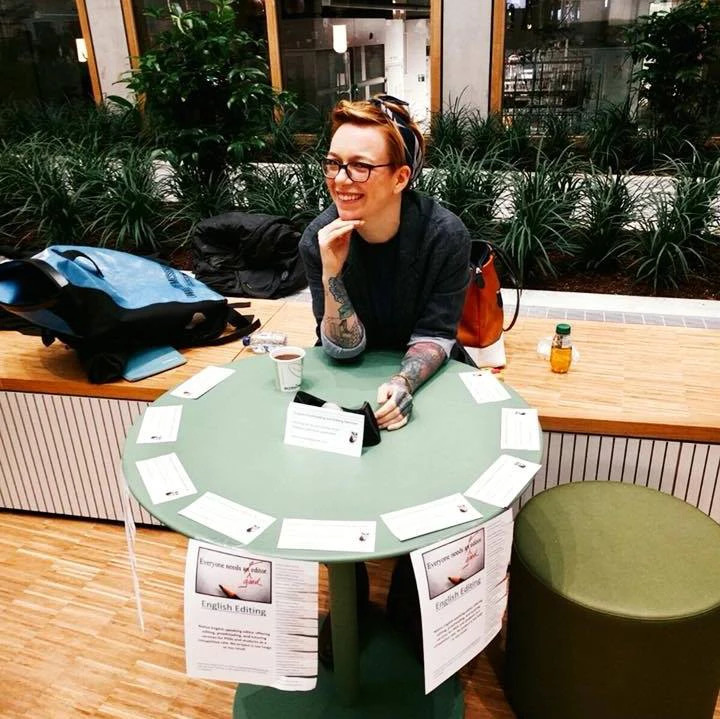

# Casali English Editing

## A BIT ABOUT ME

   | Originally from New York, I have lived in the Netherlands since 2016. I am the proud mother of two cats and two dogs, an avid bookworm, and the creator of the monthly English book-swap here in Groningen. I am a Cambridge certified English teacher and an experienced Editor.

---

## EDITING
> Academic and Business
​

My goal is to polish your writing while maintaining your narrative voice. Our work will be collaborative, and you can choose the level of editing that is right for you!

[Click here to learn more](editing)

---
## TUTORING
 > Private and Group lessons
​

With customized individual lessons, we can prioritize the parts of the English language that are most important for you. I recognize that learners have a diverse set of needs, and I welcome students of all levels!

[Click here to learn more](tutoring)
